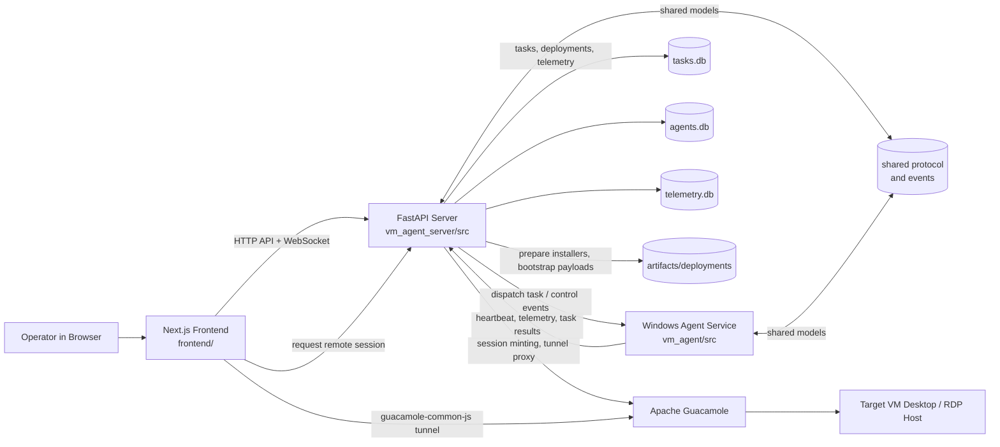
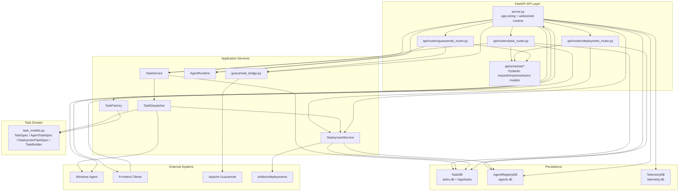
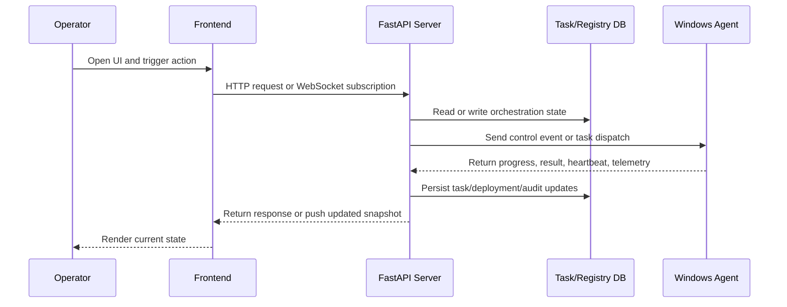
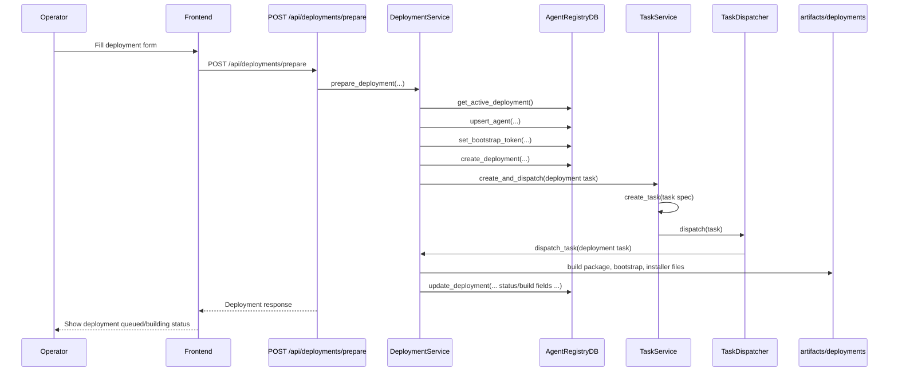
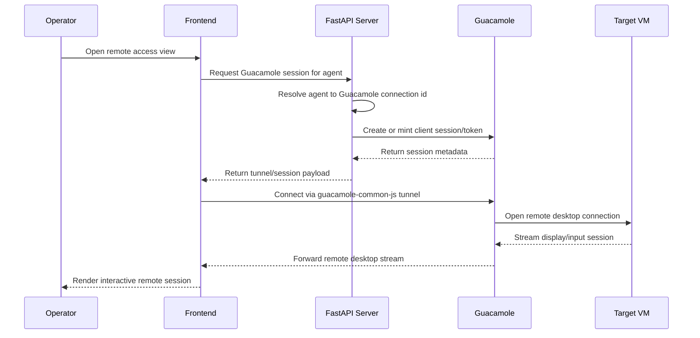
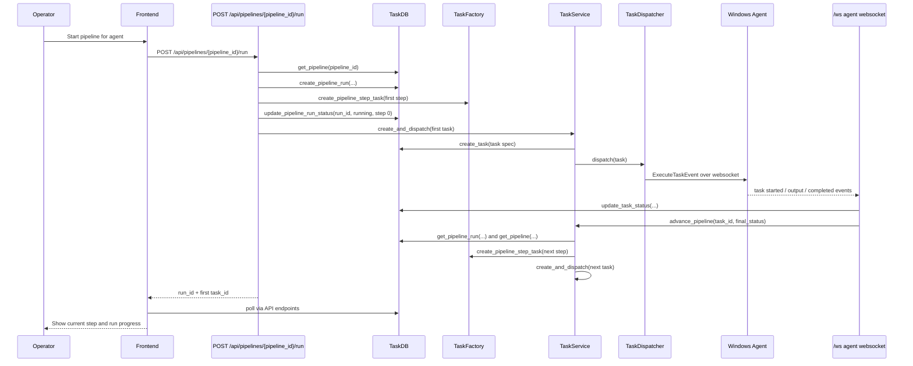
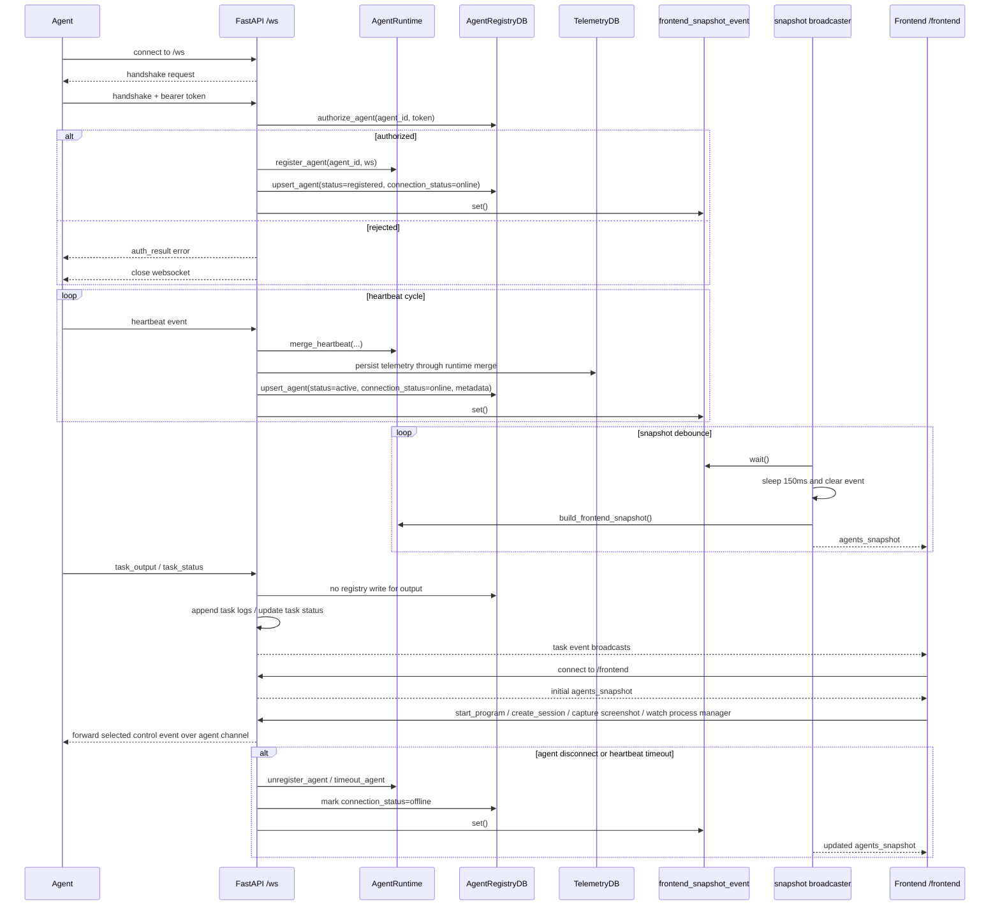

# Architecture

This document describes the high-level architecture of `my-orciestra`, the responsibility boundaries between modules, and the main runtime flows across frontend, server, agent, and Apache Guacamole.

## System Overview

The project is built around one orchestration boundary: the FastAPI server.

- The frontend never talks directly to the Windows agent.
- The Windows agent never talks directly to the frontend.
- Guacamole is used as a remote desktop transport and session provider, not as the orchestration source of truth.
- Shared protocol and event models live in `shared/` and are consumed by both the server and the agent.

## Topology

## Layers And Responsibilities

### Frontend

Location: `frontend/`

Responsibilities:

- renders operator UI,
- calls HTTP endpoints exposed by FastAPI,
- maintains operator-facing state from API and WebSocket data,
- embeds Guacamole sessions when remote access is needed.

Important notes:

- uses `NEXT_PUBLIC_API_URL` and optionally `NEXT_PUBLIC_WS_URL`,
- uses `guacamole-common-js` for remote desktop integration,
- should not implement orchestration logic that belongs in the backend.

### FastAPI Server

Location: `vm_agent_server/src/`

Responsibilities:

- acts as the single orchestration boundary,
- exposes HTTP routes for tasks, deployments, audit, and Guacamole flows,
- manages WebSocket sessions for agents and frontend clients,
- persists task, deployment, registry, and telemetry state,
- dispatches tasks by kind,
- prepares deployment artifacts and bootstrap payloads.

Important modules:

- `server.py` - composition root, WebSocket endpoints, Guacamole tunnel proxy wiring.
- `api/routers/` - HTTP route surface split by concern.
- `task_models.py` - common task model and typed variants.
- `task_dispatcher.py` - handler registry per task kind.
- `task_service.py` - persistence and orchestration of task submission and pipeline progression.
- `deployment_service.py` - deployment preparation flow and artifact generation.
- `agent_registry_db.py` - agent and deployment registry persistence.
- `task_db.py` - tasks, pipelines, audit, and task logs.
- `telemetry_db.py` - telemetry persistence.
- `guacamole_bridge.py` - Guacamole mapping, session creation, and config helpers.

### Windows Agent

Location: `vm_agent/src/`

Responsibilities:

- runs as a Windows service,
- connects to the server over WebSocket,
- performs agent-side task execution,
- reports heartbeat and telemetry,
- captures screenshots and resolves windows on demand,
- manages local process and session operations on the VM.

Important modules:

- `service/agent_service.py` - service entry point and helper commands.
- `core/agent.py` - main runtime agent loop.
- `network/` - transport and server communication.
- `telemetry/` - host and process telemetry gathering.
- `utils/process_screenshot.py` - window and desktop capture.

### Shared Protocol

Location: `shared/`

Responsibilities:

- stores network event contracts and shared data structures,
- keeps server and agent aligned on message formats.

This is the contract boundary for cross-process communication. Changes here should be made carefully and kept backward compatible where possible.

### Apache Guacamole

Responsibilities:

- provides remote desktop transport,
- exposes tunnel and session APIs consumed indirectly through FastAPI,
- is embedded into the operator workflow through frontend session data.

Guacamole does not own:

- task execution,
- agent lifecycle,
- telemetry,
- deployment orchestration.

## Backend Component Diagram

The backend inside `vm_agent_server/` is organized around a small set of orchestration services, persistence adapters, and transport entrypoints.

### Backend Notes

- `server.py` is now primarily a composition root and runtime host, not the place for every REST endpoint.
- routers are thin and defer real orchestration to services and DB adapters.
- `TaskService` owns the create-dispatch-advance lifecycle.
- `TaskDispatcher` is the branching point for `kind=agent` and `kind=deployment`.
- `DeploymentService` is both a deployment orchestrator and a task handler for deployment tasks.
- `guacamole_bridge.py` isolates Guacamole-specific config, mapping, and session helper logic from the routers.

## Runtime Flow

### 1. Operator Management Flow

Typical examples:

- create a task for an agent,
- cancel a running task,
- run a pipeline,
- inspect task logs,
- browse deployment state.

### 2. Deployment Preparation Flow

The deployment path is intentionally server-driven.

1. Operator calls `POST /api/deployments/prepare`.
2. The server allocates a deployment record and agent identity.
3. A bootstrap token is issued and stored in the registry DB.
4. The server builds the deployment package and install script.
5. Artifacts are written into `artifacts/deployments/<deployment_id>/` and optionally mirrored into `artifacts/latest/`.
6. The operator installs the payload manually or via remote access on the target VM.
7. The agent starts, reads `agent.bootstrap.json`, connects back to FastAPI, and completes bootstrap.

This model avoids storing or using personal admin credentials in the server for unattended install steps.

### 2a. Prepare Deployment Sequence With Concrete Endpoint

Endpoint contract involved:

- request entrypoint: `POST /api/deployments/prepare`
- supporting reads later in the flow:
    - `GET /api/deployments`
    - `GET /api/deployments/{deployment_id}`
    - `GET /api/deployments/{deployment_id}/installer`

### 3. Guacamole Remote Access Flow

Key point:

- the frontend requests the session from FastAPI,
- FastAPI maps the agent to the correct Guacamole target,
- the remote desktop stream is still separate from the agent control plane.

### 4. Pipeline Execution Sequence With Concrete Endpoints

Endpoint contract involved:

- create pipeline template: `POST /api/pipelines`
- inspect templates: `GET /api/pipelines`, `GET /api/pipelines/{pipeline_id}`
- launch run: `POST /api/pipelines/{pipeline_id}/run`
- inspect run: `GET /api/pipeline-runs/{run_id}`
- inspect step tasks: `GET /api/tasks/{task_id}`, `GET /api/tasks/{task_id}/log`

### 5. WebSocket Runtime Flow

The backend exposes two main WebSocket channels:

- `/ws` for Windows agents,
- `/frontend` for operator-facing live updates and frontend-originated control messages.

Important runtime behavior:

- frontend snapshots are not pushed immediately on every mutation; they are coalesced through `frontend_snapshot_event` and a short debounce loop,
- heartbeat timeouts are enforced by a background watchdog,
- task output/status updates use live event forwarding in addition to DB persistence,
- frontend control events are forwarded through FastAPI to the connected agent, not sent directly from browser to agent.

## Data Ownership

### `tasks.db`

Owned by the FastAPI server.

Contains:

- tasks,
- pipeline definitions,
- pipeline runs,
- audit data,
- task log metadata.

### `agents.db`

Owned by the FastAPI server.

Contains:

- agent registry state,
- deployment records,
- bootstrap token information,
- current connectivity and deployment linkage.

### `telemetry.db`

Owned by the FastAPI server.

Contains:

- telemetry snapshots and host/process-related measurements reported by agents.

### `artifacts/deployments/`

Owned by the deployment preparation flow.

Contains:

- prepared build outputs,
- bootstrap data,
- generated installer scripts,
- copied payloads for target machine installation.

## Task Architecture

The project uses one unified task model rather than separate unrelated representations.

Core parts:

- `TaskSpec` - common persisted task shape.
- `AgentTaskSpec` - task intended for agent execution.
- `DeploymentTaskSpec` - task intended for deployment preparation on the server side.
- `TaskBuilder` - builder-style task construction.
- `TaskDispatcher` - routes tasks to the correct execution handler.
- `TaskService` - creates, stores, dispatches, and advances tasks and pipelines.

This keeps the storage model stable while allowing specialized behavior per task kind.

## HTTP Surface

The HTTP layer is organized into routers:

- `api/routers/task_router.py`
- `api/routers/deployment_router.py`
- `api/routers/guacamole_router.py`

This keeps `server.py` focused on app wiring and WebSocket runtime behavior rather than accumulating every REST endpoint directly.

## Design Constraints

These are the intended boundaries for future work:

- Keep frontend-to-agent communication indirect through the server.
- Keep Guacamole as a transport layer, not the orchestration owner.
- Keep Windows-specific runtime logic in `vm_agent/`.
- Keep shared event contracts in `shared/`.
- Keep schema changes compatible where they cross process boundaries.
- Keep window enumeration and refresh on-demand rather than background polling.

## Failure Paths

This section describes the main negative paths that are already encoded in the current runtime behavior.

### Agent Not Online When Dispatching A Task

Path:

1. A task is created through the task API or as part of a pipeline run.
2. `TaskService.create_and_dispatch(...)` persists the task first.
3. `TaskDispatcher` routes the task to the agent handler for `kind=agent`.
4. The agent handler tries to send `ExecuteTaskEvent` to the target agent.
5. If the agent is not connected, dispatch returns `accepted=False`, `status="failed"`, `error="Agent not connected"`.
6. `TaskService.dispatch(...)` writes that failed status into `tasks.db`.

Outcome:

- standalone task ends in failed state immediately,
- pipeline step can fail the whole pipeline run depending on the step policy,
- the failure is visible through task status APIs and audit/log data.

### No Handler Registered For A Task Kind

Path:

1. A task is created with a `kind` not present in the dispatcher registry.
2. `TaskDispatcher.dispatch(...)` returns failed with `No handler registered for task kind ...`.

Outcome:

- the task is persisted but marked failed,
- this protects the system from silently dropping unknown task kinds.

### Deployment Already In Progress

Path:

1. Operator calls `POST /api/deployments/prepare`.
2. `DeploymentService.prepare_deployment(...)` checks `get_active_deployment()`.
3. If another deployment is active, the service raises `RuntimeError`.
4. The deployment router converts that into HTTP `409` and includes the active deployment payload.

Outcome:

- a second deployment does not start,
- the frontend can surface which deployment is currently blocking the request.

### Deployment Task Payload Is Incomplete Or Unsupported

Path:

1. `TaskDispatcher` routes a deployment task to `DeploymentService.dispatch_task(...)`.
2. If operation is unsupported or required payload fields are missing, dispatch returns failed.

Examples already handled in code:

- unsupported deployment operation,
- missing `deployment_id`, `hostname`, `agent_id`, `server_ws_url`, bootstrap token, or expiration.

Outcome:

- task is marked failed,
- deployment does not advance to build execution.

### Deployment Build Fails During Prepare

Path:

1. Deployment task is accepted and `_run_prepare(...)` starts.
2. Any build-time failure raises an exception, for example:
    - Python environment missing,
    - PyInstaller output missing,
    - Git command failure,
    - file generation or copy failure.
3. The deployment service catches the exception and updates both task and deployment state.

Outcome:

- deployment status becomes `failed`,
- corresponding task status becomes `failed`,
- agent registry is updated with status like `deploy_failed`,
- build error is preserved in deployment/task state and logs.

### Agent Handshake Rejected

Path:

1. Agent connects to `/ws` and sends handshake.
2. Server validates bootstrap token or long-lived secret through `AgentRegistryDB.authorize_agent(...)`.
3. The server may reject the connection for reasons such as:
    - missing bearer token,
    - expired bootstrap token,
    - hostname mismatch against expected deployment target.

Outcome:

- the websocket is closed with an auth-related reason,
- deployment and agent records may be updated to reflect `expired_bootstrap` or `hostname_mismatch`,
- the agent never becomes online in runtime state.

### Heartbeat Timeout

Path:

1. Agent stops sending heartbeats.
2. Background watchdog checks timed out agents based on `HEARTBEAT_TIMEOUT_SECONDS`.
3. `AgentRuntime.timeout_agent(...)` marks the runtime state as disconnected.
4. Snapshot broadcast is triggered.

Outcome:

- frontend receives a fresh offline snapshot,
- registry state is eventually aligned to offline state,
- future task dispatches to that agent fail until it reconnects.

### Pipeline Step Fails

Path:

1. Agent reports `task_status=failed` or `timeout`.
2. `server.py` calls `TaskService.advance_pipeline(task_id, status)`.
3. `TaskService` reads the current pipeline step definition.
4. If `on_fail == "stop"`, pipeline run is marked failed.
5. Otherwise, the next step may still be created and dispatched.

Outcome:

- pipeline run either stops at the failed step or continues according to step policy,
- the current step index and run status remain queryable via API.

### Frontend Snapshot Or WebSocket Consumer Failure

Path:

1. A frontend client disconnects or fails while receiving a pushed update.
2. Broadcast code catches the exception and removes the socket from the active frontend client set.

Outcome:

- one broken frontend connection does not block broadcasts to other clients,
- the next frontend reconnect will receive a fresh snapshot.

## Suggested Reading Order

If you are new to the repo, this is a good sequence:

1. `README.md`
2. `vm_agent_server/src/server.py`
3. `vm_agent_server/src/api/routers/`
4. `vm_agent_server/src/task_models.py`
5. `vm_agent_server/src/task_service.py`
6. `vm_agent_server/src/deployment_service.py`
7. `vm_agent/src/service/agent_service.py`
8. `shared/network/events/`

## Current Limitations

- The remote desktop path and the agent control path are intentionally separate, so some UI actions require coordination across both layers.
- Guacamole router tests are still missing.
- Some runtime data stores live as local SQLite files in the repo root during development.
